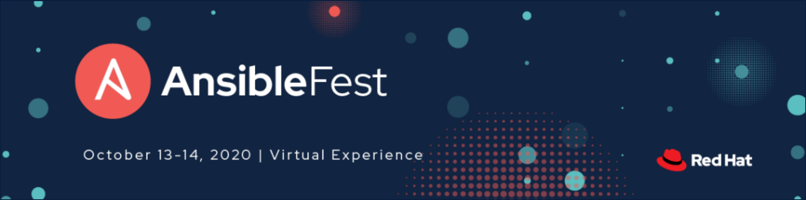

**Session:** Automating IPAM In Cloud: Ansible + Netbox

**Speaker:** William Collins

Slides can be found [here.](./slides/AnsibleFest%202020%20-%20Automating%20IPAM%20In%20Cloud.pdf)

If you are hybrid multi-cloud, it probably means you are sharing the same RFC1918 space across clouds and traditional networking. This session will take you through my experience in building a solution for this using Ansible Tower and Netbox that scales for the enterprise.

* Channel - Network
* Topics - Cloud; Infrastructure; Networks
* Audience - Design application/system architectures; Manage infrastructure
* Technical Difficulty - Very advanced
* Industry - Healthcare & life sciences

It can be challenging to fit all of your thoughts in a 30-minute session. For a more _in-depth_ look at tackling this problem, visit [wcollins.github.io](https://wcollins.github.io/post/2020/01-automating-cloud-ipam/) where I un-pack more details and broaden the context.